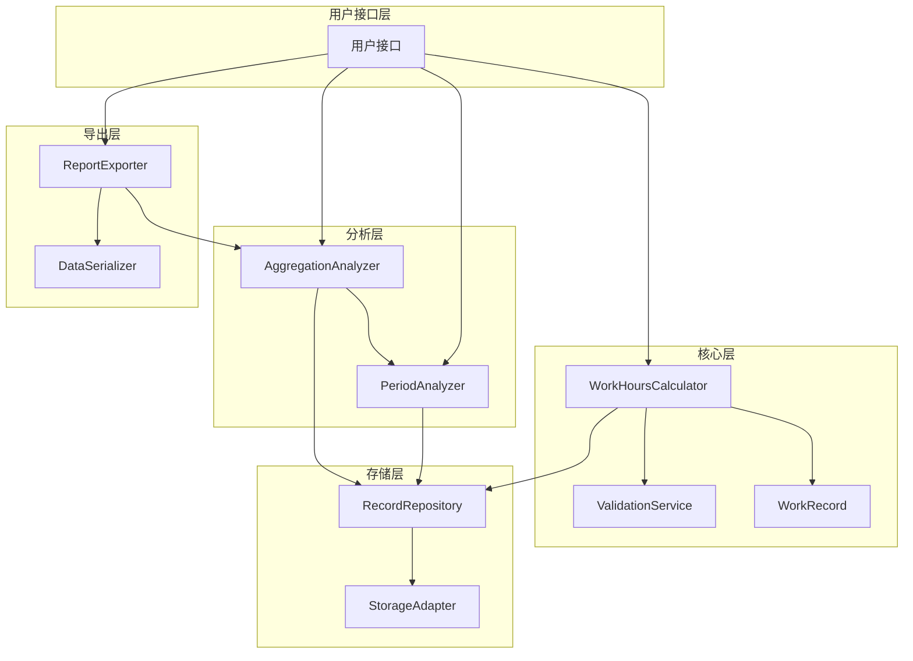

# 设计文档

## 概述

工时计算工具是一个用于记录、计算和统计员工工作时间的系统。系统基于8小时标准工作制，提供多维度的工时统计分析功能。

核心功能包括：
- 工作时间记录的创建和验证
- 每日工作时长计算（包括已工作时长、剩余时长、加班时长）
- 时段分析（上午、中午、下午）
- 多维度统计报告（日、周、月、年）
- 历史记录查询
- 数据导出功能

系统采用模块化设计，将核心计算逻辑、时段分析、聚合统计等功能分离，确保代码的可维护性和可扩展性。

## 架构

系统采用分层架构，主要包含以下模块：

### 核心层 (Core Layer)
- **WorkHoursCalculator**: 核心计算引擎，负责工作时长的基本计算
- **WorkRecord**: 工作记录数据模型
- **ValidationService**: 输入验证服务

### 分析层 (Analysis Layer)
- **PeriodAnalyzer**: 时段分析器，负责上午、中午、下午时段的数据分析
- **AggregationAnalyzer**: 聚合统计器，负责日、周、月、年维度的统计

### 存储层 (Storage Layer)
- **RecordRepository**: 工作记录存储接口
- **StorageAdapter**: 具体存储实现（可支持内存、文件、数据库等）

### 导出层 (Export Layer)
- **ReportExporter**: 报告导出服务
- **DataSerializer**: 数据序列化/反序列化



## 组件和接口

### WorkRecord (工作记录)

工作记录是系统的基本数据单元。

```typescript
interface WorkRecord {
  id: string;
  startTime: DateTime;
  endTime: DateTime;
  date: Date;
  duration: Duration;
}
```

**职责:**
- 存储单次工作时段的开始和结束时间
- 提供工作时长计算
- 确保时间的有效性

### ValidationService (验证服务)

```typescript
interface ValidationService {
  validateWorkRecord(record: WorkRecord): ValidationResult;
  validateDateRange(start: Date, end: Date): ValidationResult;
}

interface ValidationResult {
  isValid: boolean;
  errors: string[];
}
```

**职责:**
- 验证工作记录的时间逻辑（开始时间必须早于结束时间）
- 验证日期范围的有效性
- 返回详细的验证错误信息

### WorkHoursCalculator (工时计算器)

```typescript
interface WorkHoursCalculator {
  addWorkRecord(record: WorkRecord): Result<void, ValidationError>;
  getDailyWorkHours(date: Date): DailyWorkHours;
  getWorkRecords(dateRange: DateRange): WorkRecord[];
  getWorkRecords(date: Date): WorkRecord[];
}

interface DailyWorkHours {
  date: Date;
  totalHours: Duration;
  workedHours: Duration;
  remainingHours: Duration;
  overtimeHours: Duration;
  standardHours: Duration; // 固定为8小时
}
```

**职责:**
- 接收和存储工作记录
- 计算每日工作时长统计
- 提供历史记录查询功能
- 协调验证服务进行数据验证

### PeriodAnalyzer (时段统计器)

```typescript
interface PeriodAnalyzer {
  analyzePeriods(records: WorkRecord[]): PeriodStatistics;
}

interface PeriodStatistics {
  morning: PeriodData;
  noon: PeriodData;
  afternoon: PeriodData;
}

interface PeriodData {
  averageDuration: Duration;
  averageStartTime?: Time; // 仅上午时段有此字段
  totalDuration: Duration;
  recordCount: number;
}

interface PeriodDefinition {
  morning: TimeRange;    // 例如: 00:00 - 12:00
  noon: TimeRange;       // 例如: 12:00 - 14:00
  afternoon: TimeRange;  // 例如: 14:00 - 24:00
}
```

**职责:**
- 识别工作记录所属的时段
- 处理跨时段的工作记录，将时长正确分配到各时段
- 计算各时段的平均工作时长
- 计算上午时段的平均开始时间

### AggregationAnalyzer (聚合统计器)

```typescript
interface AggregationAnalyzer {
  generateDailyReport(date: Date): DailyReport;
  generateWeeklyReport(weekStart: Date): WeeklyReport;
  generateMonthlyReport(year: number, month: number): MonthlyReport;
  generateYearlyReport(year: number): YearlyReport;
}

interface DailyReport {
  date: Date;
  totalHours: Duration;
  workedHours: Duration;
  remainingHours: Duration;
  overtimeHours: Duration;
  periodBreakdown: PeriodStatistics;
}

interface WeeklyReport {
  weekStart: Date;
  weekEnd: Date;
  totalHours: Duration;
  averageDailyHours: Duration;
  totalOvertime: Duration;
  periodAverages: PeriodStatistics;
  workDays: number;
}

interface MonthlyReport {
  year: number;
  month: number;
  totalHours: Duration;
  averageDailyHours: Duration;
  totalOvertime: Duration;
  periodAverages: PeriodStatistics;
  workDays: number;
}

interface YearlyReport {
  year: number;
  totalHours: Duration;
  averageDailyHours: Duration;
  totalOvertime: Duration;
  periodAverages: PeriodStatistics;
  workDays: number;
  monthlyBreakdown: MonthlyReport[];
}
```

**职责:**
- 生成日、周、月、年维度的统计报告
- 聚合多个工作记录的数据
- 计算平均值和总计值
- 协调 PeriodAnalyzer 获取时段统计数据

### RecordRepository (记录存储库)

```typescript
interface RecordRepository {
  save(record: WorkRecord): Promise<void>;
  findByDate(date: Date): Promise<WorkRecord[]>;
  findByDateRange(start: Date, end: Date): Promise<WorkRecord[]>;
  findAll(): Promise<WorkRecord[]>;
}
```

**职责:**
- 提供工作记录的持久化存储
- 支持按日期和日期范围查询
- 抽象具体的存储实现

### ReportExporter (报告导出器)

```typescript
interface ReportExporter {
  exportDailyReport(report: DailyReport): string;
  exportWeeklyReport(report: WeeklyReport): string;
  exportMonthlyReport(report: MonthlyReport): string;
  exportYearlyReport(report: YearlyReport): string;
  importReport(data: string): Report;
}

type Report = DailyReport | WeeklyReport | MonthlyReport | YearlyReport;
```

**职责:**
- 将报告对象序列化为结构化数据格式（JSON）
- 支持报告数据的反序列化
- 确保导出/导入的往返一致性

## 数据模型

### 核心数据类型

```typescript
// 时间相关类型
type DateTime = {
  year: number;
  month: number;
  day: number;
  hour: number;
  minute: number;
  second: number;
};

type Date = {
  year: number;
  month: number;
  day: number;
};

type Time = {
  hour: number;
  minute: number;
  second: number;
};

type Duration = {
  hours: number;
  minutes: number;
  seconds: number;
};

type TimeRange = {
  start: Time;
  end: Time;
};

type DateRange = {
  start: Date;
  end: Date;
};

// 常量
const STANDARD_WORK_HOURS: Duration = { hours: 8, minutes: 0, seconds: 0 };

const PERIOD_DEFINITIONS: PeriodDefinition = {
  morning: { 
    start: { hour: 0, minute: 0, second: 0 },
    end: { hour: 12, minute: 0, second: 0 }
  },
  noon: {
    start: { hour: 12, minute: 0, second: 0 },
    end: { hour: 14, minute: 0, second: 0 }
  },
  afternoon: {
    start: { hour: 14, minute: 0, second: 0 },
    end: { hour: 24, minute: 0, second: 0 }
  }
};
```

### 数据流

1. **记录创建流程:**
   - 用户输入 → ValidationService → WorkHoursCalculator → RecordRepository

2. **统计查询流程:**
   - 用户请求 → AggregationAnalyzer → RecordRepository → PeriodAnalyzer → 报告生成

3. **导出流程:**
   - 报告对象 → ReportExporter → DataSerializer → 结构化数据

### 数据约束

- `WorkRecord.startTime` 必须早于 `WorkRecord.endTime`
- `STANDARD_WORK_HOURS` 固定为 8 小时
- 时段定义不重叠且覆盖完整的24小时
- 所有时间计算精确到秒
- `remainingHours` 不能为负数（最小为0）
- `overtimeHours` 仅在 `workedHours > standardHours` 时大于0


## 正确性属性

*属性是一个特征或行为，应该在系统的所有有效执行中保持为真——本质上是关于系统应该做什么的形式化陈述。属性作为人类可读规范和机器可验证正确性保证之间的桥梁。*

### 属性反思

在分析了所有验收标准后，我识别出以下需要合并或消除的冗余：

1. **需求4（日报告）和需求5-7（周/月/年报告）的字段包含属性（4.1-4.5, 5.1-5.6, 6.1-6.7, 7.1-7.8）**: 这些都是在测试报告对象是否包含必需字段。可以合并为一个属性：所有报告都应包含其规范要求的字段。

2. **时段识别属性（3.1-3.3）**: 这三个属性都在测试时段识别功能，可以合并为一个综合属性：系统应该正确识别所有时段。

3. **平均时长计算属性（3.5-3.7）**: 这三个属性都在测试平均时长计算，可以合并为一个属性：各时段的平均时长计算应该正确。

4. **聚合总计属性（5.2, 5.4, 6.2, 6.4, 7.2, 7.4）**: 这些都在测试总工作时长和总加班时长的聚合计算，可以合并为一个属性：聚合统计的总计值应该等于各组成部分之和。

5. **平均每日工作时长属性（5.3, 6.3, 7.3）**: 这些都在测试相同的计算逻辑，可以合并为一个属性。

6. **工作天数计算属性（6.7, 7.7）**: 这两个属性测试相同的逻辑，可以合并。

7. **已工作时长属性（2.2）**: 这个属性实际上被2.1包含了，因为已工作时长就是总工作时长。

经过反思，我将从43个初始可测试标准中提炼出更精简、无冗余的属性集合。

### 属性 1: 工作记录持久化往返

*对于任意*有效的工作记录，添加到系统后再查询应该能获取到等价的记录。

**验证需求: 1.1, 1.4**

### 属性 2: 时间顺序验证

*对于任意*工作记录，如果开始时间早于结束时间，系统应该接受该记录；如果开始时间晚于或等于结束时间，系统应该拒绝该记录并返回验证错误。

**验证需求: 1.2, 1.3**

### 属性 3: 每日总工作时长计算

*对于任意*日期和该日期的工作记录集合，计算出的总工作时长应该等于所有记录的时长之和。

**验证需求: 2.1**

### 属性 4: 剩余工作时长计算

*对于任意*每日工作数据，当已工作时长小于标准工时（8小时）时，剩余工作时长应该等于标准工时减去已工作时长；当已工作时长大于或等于标准工时时，剩余工作时长应该为零。

**验证需求: 2.3, 2.4**

### 属性 5: 加班时长计算

*对于任意*每日工作数据，当已工作时长超过标准工时（8小时）时，加班时长应该等于已工作时长减去标准工时；否则加班时长应该为零。

**验证需求: 2.5**

### 属性 6: 时段识别和分配

*对于任意*工作记录，系统应该能够正确识别该记录所属的时段（上午、中午、下午），并且当记录跨越多个时段时，应该将工作时长正确分配到各个时段。

**验证需求: 3.1, 3.2, 3.3, 9.1**

### 属性 7: 时段分配守恒

*对于任意*跨时段的工作记录，分配到各时段的工作时长之和必须等于该记录的总工作时长。

**验证需求: 9.2**

### 属性 8: 时段平均时长计算

*对于任意*工作记录集合和指定时段，该时段的平均工作时长应该等于该时段的总工作时长除以该时段的记录数量。

**验证需求: 3.5, 3.6, 3.7**

### 属性 9: 上午平均开始时间计算

*对于任意*包含上午时段工作的记录集合，上午平均开始时间应该等于所有上午工作记录的开始时间的算术平均值。

**验证需求: 3.4**

### 属性 10: 报告字段完整性

*对于任意*统计报告（日、周、月、年），报告对象应该包含其类型所要求的所有必需字段（总工作时长、已工作时长、剩余工作时长、加班时长、时段统计等）。

**验证需求: 4.1, 4.2, 4.3, 4.4, 4.5, 5.1, 5.5, 5.6, 6.1, 6.5, 6.6, 7.1, 7.5, 7.6, 7.8**

### 属性 11: 聚合总计正确性

*对于任意*时间范围（周、月、年）的统计报告，报告中的总工作时长应该等于该时间范围内所有日的总工作时长之和，总加班时长应该等于所有日的加班时长之和。

**验证需求: 5.2, 5.4, 6.2, 6.4, 7.2, 7.4**

### 属性 12: 平均每日工作时长计算

*对于任意*时间范围（周、月、年）的统计报告，平均每日工作时长应该等于总工作时长除以工作天数。

**验证需求: 5.3, 6.3, 7.3**

### 属性 13: 工作天数计算

*对于任意*时间范围（月、年）的统计报告，工作天数应该等于该时间范围内有工作记录的不同日期的数量。

**验证需求: 6.7, 7.7**

### 属性 14: 日期范围查询正确性

*对于任意*日期范围，查询返回的所有工作记录的日期都应该在指定的范围内（包含边界）。

**验证需求: 8.1**

### 属性 15: 查询结果时间排序

*对于任意*查询返回的工作记录列表，记录应该按照开始时间的升序排列。

**验证需求: 8.2**

### 属性 16: 单日查询正确性

*对于任意*指定日期，查询返回的所有工作记录都应该属于该日期。

**验证需求: 8.3**

### 属性 17: 报告导出格式有效性

*对于任意*统计报告（日、周、月、年），导出操作应该生成有效的结构化数据格式（JSON）。

**验证需求: 10.1, 10.2**

### 属性 18: 报告序列化往返

*对于任意*有效的统计报告对象，执行导出然后导入然后再导出的操作序列，最终产生的数据应该与第一次导出的数据等价。

**验证需求: 10.3**

## 错误处理

系统应该优雅地处理各种错误情况：

### 验证错误

**场景**: 用户提交无效的工作记录
- 开始时间晚于或等于结束时间
- 日期格式无效
- 时间值超出有效范围

**处理策略**:
- 返回详细的验证错误信息，说明具体的验证失败原因
- 不保存无效记录到存储层
- 使用 Result 类型封装成功/失败状态

```typescript
type Result<T, E> = 
  | { success: true; value: T }
  | { success: false; error: E };

type ValidationError = {
  field: string;
  message: string;
  code: string;
};
```

### 查询错误

**场景**: 查询不存在的数据或无效的日期范围
- 日期范围的开始日期晚于结束日期
- 查询的日期不存在工作记录

**处理策略**:
- 对于无效的日期范围，返回验证错误
- 对于不存在的数据，返回空列表或零值统计（而非错误）
- 确保查询操作的幂等性

### 存储错误

**场景**: 持久化操作失败
- 磁盘空间不足
- 文件权限问题
- 数据库连接失败

**处理策略**:
- 使用 Promise/Result 类型传播错误
- 提供清晰的错误消息
- 不破坏已有数据的完整性
- 考虑实现重试机制（针对临时性故障）

### 计算错误

**场景**: 数值计算异常
- 时长计算溢出
- 除零错误（例如工作天数为0时计算平均值）

**处理策略**:
- 对于除零情况，返回零值或 undefined
- 使用安全的数值类型防止溢出
- 在计算前验证输入的有效性

### 导出/导入错误

**场景**: 序列化或反序列化失败
- JSON 格式无效
- 数据结构不匹配
- 字段缺失或类型错误

**处理策略**:
- 验证导入数据的结构和类型
- 提供详细的解析错误信息
- 使用版本标识支持数据格式演进

## 测试策略

系统采用双重测试方法，结合单元测试和基于属性的测试，以确保全面的代码覆盖和正确性验证。

### 单元测试

单元测试专注于具体示例、边界情况和错误条件：

**核心功能测试**:
- 测试标准8小时工作日的计算
- 测试跨午夜的工作记录
- 测试空记录列表的处理
- 测试单条记录的各种场景

**边界情况**:
- 工作时长恰好等于8小时
- 工作时长为0（开始和结束时间相同的边界）
- 时段边界时刻（如12:00:00）的记录
- 跨越所有三个时段的工作记录

**错误条件**:
- 开始时间等于结束时间
- 开始时间晚于结束时间
- 无效的日期值
- 空的日期范围查询

**集成测试**:
- 完整的记录添加到报告生成流程
- 多日数据的聚合统计
- 导出和导入的完整流程

### 基于属性的测试

基于属性的测试验证系统在所有可能输入下的通用属性。我们将使用适合目标编程语言的属性测试库（例如 JavaScript/TypeScript 使用 fast-check，Python 使用 Hypothesis，Java 使用 jqwik）。

**配置要求**:
- 每个属性测试至少运行 100 次迭代
- 每个测试必须用注释标记其对应的设计属性
- 标记格式: `// Feature: work-hours-calculator, Property {number}: {property_text}`

**属性测试覆盖**:

1. **属性 1 - 工作记录持久化往返**
   - 生成随机的有效工作记录
   - 添加后查询，验证数据等价性

2. **属性 2 - 时间顺序验证**
   - 生成随机的时间对
   - 验证验证逻辑的正确性

3. **属性 3 - 每日总工作时长计算**
   - 生成随机的工作记录集合
   - 验证总时长等于各部分之和

4. **属性 4 - 剩余工作时长计算**
   - 生成随机的工作时长
   - 验证剩余时长的计算逻辑

5. **属性 5 - 加班时长计算**
   - 生成随机的工作时长
   - 验证加班时长的计算逻辑

6. **属性 6 - 时段识别和分配**
   - 生成随机的工作记录（包括跨时段）
   - 验证时段识别和分配的正确性

7. **属性 7 - 时段分配守恒**
   - 生成随机的跨时段工作记录
   - 验证分配后的总和不变性

8. **属性 8 - 时段平均时长计算**
   - 生成随机的工作记录集合
   - 验证平均值计算的正确性

9. **属性 9 - 上午平均开始时间计算**
   - 生成随机的上午工作记录
   - 验证平均开始时间的计算

10. **属性 10 - 报告字段完整性**
    - 生成随机的工作数据
    - 验证生成的报告包含所有必需字段

11. **属性 11 - 聚合总计正确性**
    - 生成随机的多日工作数据
    - 验证聚合总计的正确性

12. **属性 12 - 平均每日工作时长计算**
    - 生成随机的多日工作数据
    - 验证平均值计算的正确性

13. **属性 13 - 工作天数计算**
    - 生成随机的多日工作数据
    - 验证工作天数统计的正确性

14. **属性 14 - 日期范围查询正确性**
    - 生成随机的日期范围和工作记录
    - 验证查询结果的正确性

15. **属性 15 - 查询结果时间排序**
    - 生成随机的工作记录
    - 验证查询结果的排序

16. **属性 16 - 单日查询正确性**
    - 生成随机的日期和工作记录
    - 验证单日查询的正确性

17. **属性 17 - 报告导出格式有效性**
    - 生成随机的报告对象
    - 验证导出数据的格式有效性

18. **属性 18 - 报告序列化往返**
    - 生成随机的报告对象
    - 验证导出-导入-导出的往返一致性

### 测试数据生成策略

为了有效地进行基于属性的测试，需要实现以下数据生成器：

**时间生成器**:
- 生成有效的 DateTime、Date、Time 值
- 生成有效的时间范围
- 生成跨时段的时间范围

**工作记录生成器**:
- 生成有效的工作记录（开始时间 < 结束时间）
- 生成无效的工作记录（用于错误测试）
- 生成特定时段的工作记录
- 生成跨时段的工作记录

**报告生成器**:
- 生成各类型的统计报告对象
- 确保生成的数据满足业务约束

### 测试覆盖目标

- 单元测试代码覆盖率: ≥ 90%
- 属性测试覆盖所有18个正确性属性
- 集成测试覆盖主要用户流程
- 错误处理路径的完整测试

### 持续集成

- 所有测试应该在 CI/CD 流程中自动运行
- 属性测试失败时应该报告导致失败的具体输入
- 性能测试确保大数据量下的响应时间可接受
